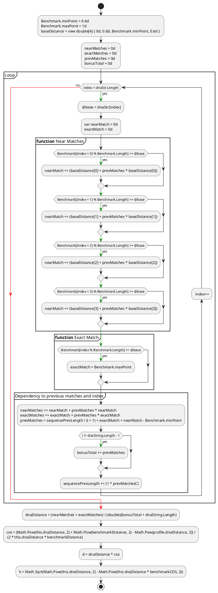

# CATSequenceAnalysis
Example implementation of CAT method for DNA sequence analysis

```plantuml
@startuml
start
:Benchmark.minPoint = 0.4d
Benchmark.maxPoint = 1d
baseDistance = new double[4] { 0d, 0.6d, Benchmark.minPoint, 0.6d } ;
:nearMatches = 0d
exactMatches = 0d 
prevMatches = 0d  
bonusTotal = 0d ;
partition "Loop"{
while (index < dnaStr.Length) is (yes)
-[#green]->
: @base = dnaStr[index];
:var nearMatch = 0d 
exactMatch = 0d;
partition "**function** Near Matches" {
    if(Benchmark[(index + 0) % Benchmark.Length] == @base) then (yes)
    -[#green]->
        :nearMatch += (baseDistance[0] + prevMatches * baseDistance[0]);
    endif 
    -[#green]->
    if(Benchmark[(index + 1) % Benchmark.Length] == @base) then (yes)
    -[#green]->
        :nearMatch += (baseDistance[1] + prevMatches * baseDistance[1]);
    endif
    -[#green]->
    if(Benchmark[(index + 2) % Benchmark.Length] == @base) then (yes)
    -[#green]->
        :nearMatch += (baseDistance[2] + prevMatches * baseDistance[2]);
    endif
    -[#green]->
    if(Benchmark[(index + 3) % Benchmark.Length] == @base) then (yes)
    -[#green]->
        :nearMatch += (baseDistance[3] + prevMatches * baseDistance[3]);
    endif
    -[#green]->
}

partition "**function** Exact Match" {

    if(Benchmark[index % Benchmark.Length] == @base) then (yes)
    -[#green]->
        :exactMatch = Benchmark.maxPoint;
    endif
}

partition "Dependency to previous matches and index" {
:nearMatches += nearMatch + prevMatches * nearMatch 
exactMatches += exactMatch + prevMatches * exactMatch 
prevMatches = sequencePrevLength / (i + 1) + exactMatch + nearMatch - Benchmark.minPoint;

if(i != dnaString.Length - 1) then (yes)
-[#green]->
:bonusTotal += prevMatches;
endif

:sequencePrevLength += (1 * prevMatchesC);
}

backward: index++;

endwhile (no)
-[#red]->
}
:dnaDistance = (nearMatches + exactMatches) / (double)(bonusTotal + dnaString.Length);
:cos = (Math.Pow(this.dnaDistance, 2) + Math.Pow(benchmarkDistance, 2) - Math.Pow(profile.dnaDistance, 2)) /\n (2 * this.dnaDistance * benchmarkDistance);
:d = dnaDistance * cos;
:h = Math.Sqrt(Math.Pow(this.dnaDistance, 2) - Math.Pow(this.dnaDistance * benchmarkCOS, 2));
stop
@enduml
```
