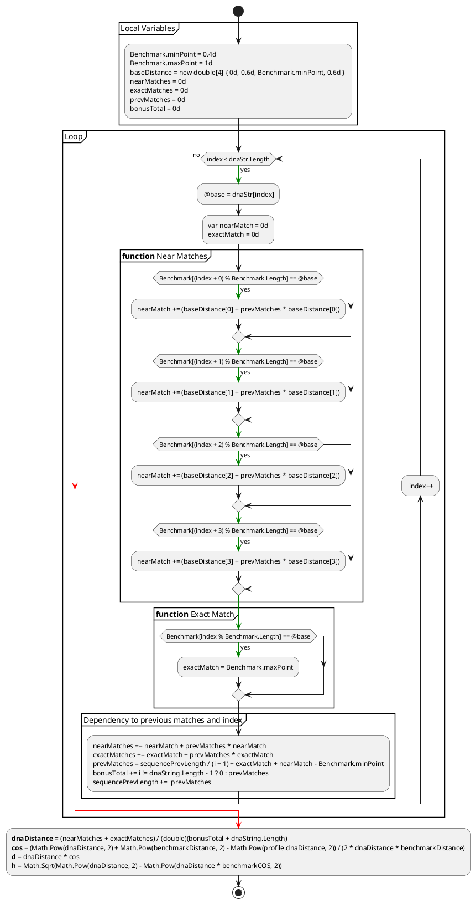

# CATSequenceAnalysis

## Tests 
 Test ceases have 3 tetsCases sources, which can be edited and allows you to run the test with variety of sequence lengths. 
  - SequenceLengthProvider - is the source for  CanContributeForFormingTriangle and CollisionReportFor_1000
    - CanContributeForFormingTriangle - test if sequences with provided length can contribute for applying of trilateration method, i.e. calculated CAT profile can form a triangle which is essential for method of trilateration 
    - CollisionReportFor_1000 - generate report with number collisions which can occurs for all combination for a sequence with a particular length.
  - CompareCATwithNWProvider - is the source for CompareCATwithNW and CompareCATwithNWLong
    - CompareCATwithNW and CompareCATWithKMP generates report from CAT and Needleman–Wunsch or Knuth–Morris–Pratt comparison, where a subsequence with different length and from different places (from the first half, from the second half, from the middle ) is  taken from the input sequence. This tests also generates sequence with random length and makes the same comparison
  - CompareCATwithNWLongProvider - source for CompareCATwithNWLong, which is similar to CompareCATwithNW, but for each experiment (input source ) a new task is starter for a faster execution of the test

 - CombineCompareCATWithKMP - has to be ran after CompareCATWithKMP to combine all reports in a single csv for a easier processing of the results. 
 - CombineCompareCATWithNW - has to be ran after CompareCATwithNW to combine all reports in a single csv for a easier processing of the results.  

All reports are generated in the \SequenceAnaliseTests\bin\Debug\net6.0 folder 

 ## Reports' header legend 

- Dna1 Length - length of the 1-st DNA sequence
- Dna2 Length - length of the 1-st DNA sequence
- Kind - kind of teh second sequence, if it is a subsequence form the 1-st one and from which part is taken (from the first half, from the second half, from the middle) or it is random generated sequence 
- CAT Result - rate of similarity after comparison with CAT in [0-1]
- CAT ms - time in ms to perform the comparison with CAT
- NW Result	- rate of similarity after comparison with Needleman–Wunsch in [0-1]
- NW ms - time in ms to perform the comparison with Needleman–Wunsch
- KMP Result	- rate of similarity after comparison with Knuth–Morris–Pratt in [0-1]
- KMP ms - time in ms to perform the comparison with Knuth–Morris–Pratt

- dna string - raw data of the sequence 
- totalRecords - total number of all combination for a sequences with length given as input parameter 
- cat matches - total number of collisions 
- [0.1 - 1.0] - rate of similarity after comparison with Needleman–Wunsch for a sequence which is discovered as collision based on CAT

## How to run tests

 Open *sln file and run desired test from teh test explorer https://learn.microsoft.com/en-us/visualstudio/test/run-unit-tests-with-test-explorer?view=vs-2022. Keep in mind that some test takes longer (up to couple of hours) based on the machine and sequence length which is examined. This is the reason why test generates a reports in *.csv for storing the results. 

> **Warning:**
> For localizations like German where separator for csv is ';' and decimal separator is ',' instead of '.' opening the reports in Excel could appear weird  - https://answers.microsoft.com/en-us/msoffice/forum/all/power-query-how-to-import-a-csv-file-that-does-not/e19fe942-80ad-4ac1-a164-061e7cac9486      

## Block diagram  of CAT method for DNA sequence analysis

